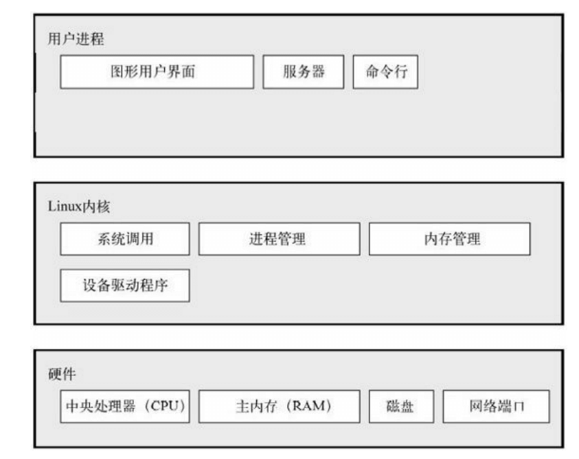
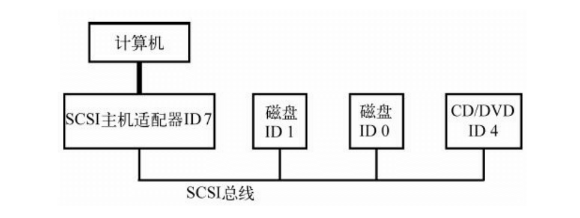
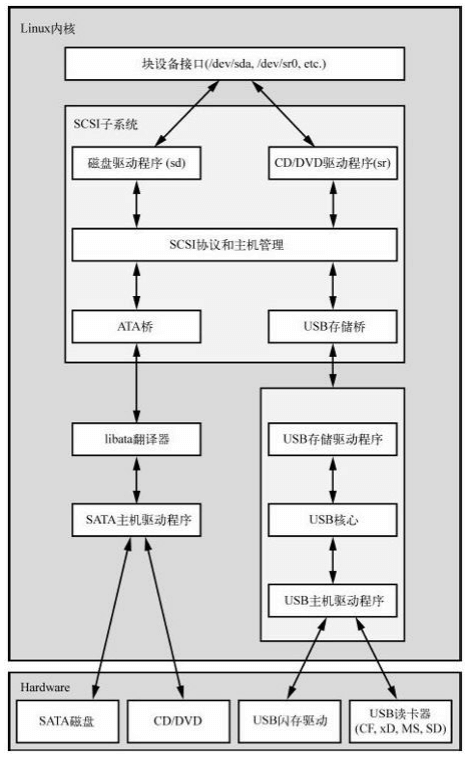
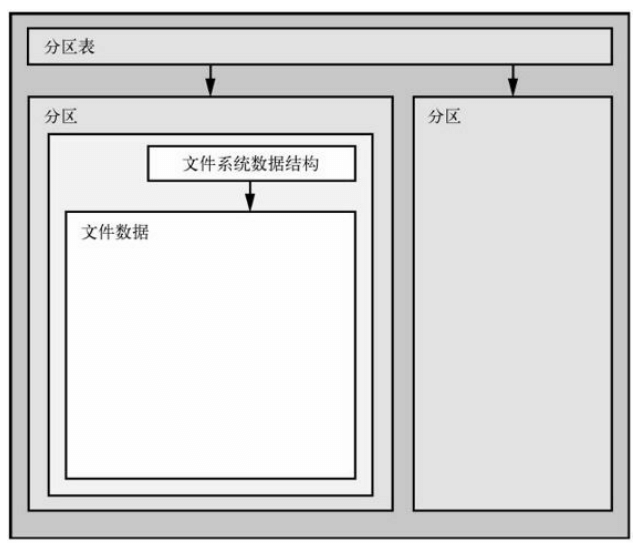
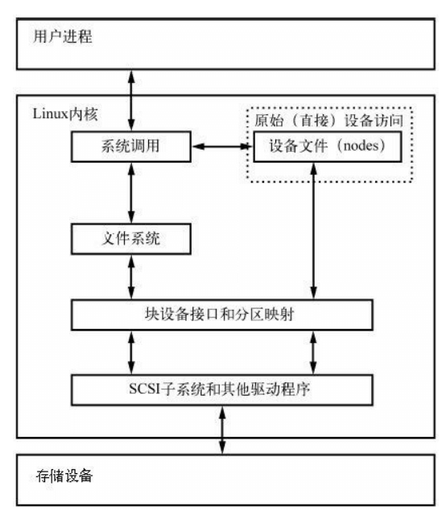

### 一、概述Linux系统的抽象级别和层级

#### 1、基本构成

操作系统在 应用程序和硬件中间   应用 -- Linux -- 硬件

Linux自身分为三层：底层硬件系统、内核、进程

底层硬件系统：内存、中央处理器、硬盘、网络接口

内核：硬件系统和应用程序之间的通信接口

进程：计算机系统中运行的所有程序，由内核统一管理，称为：User Space 用户空间

 

内核和进程区别： 
 
 内核在内核模式(kernel mode)中运行，对 内存和CPU 访问不受限制，内核模式可以访问的空间，称为内核空间(kernel space)

 用户进程在用户模式运行(user mode)

#### 2、主内存（main memory）

内核和进程都是在主内存中运行

state(状态)，是指一组特定排列的bit

image(映射)，是指比特值在内存中的特定物理排序

#### 3、内核

内核负责内容：
  (1) 进程 决定哪个进程可以使用CPU
  (2) 内存 对内存进行分配
  (3) 设备驱动程序 硬件和进程的接口，负责控制硬件
  (4) 系统调用和支持 进程使用系统调用和内核通信

##### 3.1 多进程上下文切换

单CPU同时运行多个进程

1、cpu对每个进程都有计时，时间到了切换内核模式，内核接管CPU
2、内核记录当前CPU计算状态信息，便于恢复时使用；
3、内核执行上一时间段任务（磁盘读写等）
4、内核选择下一个准备就绪进程
5、内核为新进程准备CPU和内存
6、内核将新进程的时间段通知CPU
7、内核将CPU切换成用户模式，将CPU控制权转交给新进程

> 综上所述：内核是在上下文切换时的时间段间隙中运行的。

##### 3.2 内存管理  

* 内核需要自己的专有内存空间，其他的用户进程无法访问;
* 每个用户进程有自己的专有内存空间；
* 一个进程不能访问另一个进程的专有内存空间；
* 用户进程之间可以共享内存；
* 用户进程的某些内存空间可以是只读的；
* 通过使用磁盘交换，系统可以使用比实际内存容量更多的内存空间。

1、新型的CPU提供了MMU（Memory Management Unit，内存管理单元），MMU使用了一种叫作虚拟内存的内存访问机制，即进程不是直接访问内存的实际物理地址，而是通过内核使得进程看起来可以使用整个系统的内存。

2、当进程访问内存的时候，MMU截获访问请求，然后通过内存映射表将要访问的内存地址转换为实际的物理地址。

3、内核需要初始化、维护和更新这个地址映射表。例如，在上下文切换时，内核将内存映射表从被移出进程转给被移入进程使用。

4、内存地址映射通过内存页面表（page table）来实现

##### 3.3 设备驱动程序和设备管理

通常设备只能在内核模式中被访问： 安全 + 简化开发

##### 3.4 系统调用和系统支持

系统调用（system call或syscall）为进程执行一些它们不擅长或无法完成的工作。打开、读取和写文件这些操作都涉及系统调用。

两种不同形式的系统调用：

> fork()：当进程调用fork()时，内核创建一个和该进程几乎一模一样的副本。
> exec()：当进程调用exec(program)时，内核启动program来替换当前的进程。

除去init方式，用户进程都是调用fork方式启动；

另外可以使用exec方式启动调用，例如终端执行： ls 命令：终端shell会使用 fork() 创建一个shell副本，然后该副本调用 exec(shell) 运行 ls。

#### 4、用户空间

内核分配给用户进程的内存我们称之为用户空间。

#### 5、用户

一个用户代表一个实体，它有权限运行用户进程，对文件拥有所有权。

root 超级用户

用户组

### 二、基础命令和目录结构

#### 1、shell与Bash

shell是Unix操作系统用于进行命令交互界面。可以提供一个小编程环境。

基于Bell实验室的Bourne shell（/bin/sh）开发

Linux是该Shell增强版，称作bash

Ubuntu 提示符：name@host:path$（用户名@主机名:路径$）；Fedora上，提示符是这样：[name@hostpath]$；shell窗口类似Windows上的DOS，OS X和Linux中的shell窗口一样

\# 开始为root用户运行

#### 2、基本命令

> cat filepath filepath

Unix进程使用I/O流来读写数据。进程从输入流中读取数据，向输出流写出数据

标准输入和标准输出通常简写为stdin和stdout。

### 三、设备管理

在Unix系统中操纵大多数设备都很容易，因为很多I/O接口都是以文件的形式由内核呈现给用户的。这些设备文件有时又叫作设备节点。开发人员可以像操作文件一样来操作设备，一些Unix标准命令（如cat）也可以访问设备，所以不仅仅开发人员，普通用户也能够访问设备。然而对文件接口所能执行的操作是有限制的，所以并不是所有设备或设备功能都能够通过标准文件I/O方式来访问。

Linux处理设备文件放在 /dev目录下

ls -l命令，可以查看文件类型 第一个字符： 字符b（block）、c（character）、p（pipe）和s（socket）代表设备文件

1、程序可以按照大小从块设备读取固定大小数据

2、字符设备处理流数据

3、管道设备和字符相似，但是是输出给另外一个程序

4、套接字是跨进程通信使用

#### 硬盘

硬盘设备大部分都以sd为前缀来命名
例如： /dev/sda  /dev/sdb 

sd代表SCSI disk  小型计算机系统接口（Small Computer System Inteface，以下简称SCSI）

不同分区：  /dev/sda1  /dev/sda2

##### CD和DVD：/dev/sr*

#### PATA硬盘：/dev/hd*

#### 终端设备/dev/tty/*、/dev/pts/*和/dev/tty

#### 串行端口：/dev/ttyS*

#### 并行端口：/dev/lp0和/dev/lp1

#### 音频设备：/dev/snd/*、/dev/dsp、/dev/audio和其他

### SCSI和Linux内核

传统的SCSI硬件设置是通过SCSI总线链接设备到主机适配器,主机适配器和设备都有一个SCSI ID，每个总线有8到16个ID。

 

主机适配器通过SCSI命令集与设备进行一对一通信，设备向其发送响应消息。

 

### 第四章 硬盘和文件系统

硬盘分区和文件系统关系图：

 

内核磁盘访问图解：

 
  

