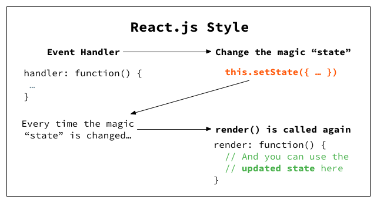

### **react分享** 

#### 概述
本次分享分为四个部分
* 1、从jQuery到react；
* 2、react和react的生态圈 ( jsx + babel + Webpack + react-hot-reload + ts + less + sass )
* 3、react几个重要基本概念（jsx、virtual dom、生命周期和钩子函数）
* 4、公司内react的使用情况（ dva + antd ）
其中：
  dva = react + react-router + redux + redux-saga
  antd = UI + 功能组件

#### 一、从jQuery到React

##### 1、jQuery写法和风格

选择器 + dom操作

 
 
##### 2、react写法和风格

事件绑定 + 数据处理

 


> 当只有一个事件而且处理对象只有一个DOM的时候，利用jquery写出的代码是非常简单的。当多个事件多个处理对象的时候，jQuery会有明显的劣势。

对比如下：

 


#### 二、react和react的生态圈

##### 1、jsx

```
  const element = <h1>Hello, world!</h1>;
```

既不是JS，也不是HTML，被称为JSX。JSX是一种JavaScript的语法扩展。本质上来讲，JSX 只是为 React.createElement(component, props, ...children) 方法提供的语法糖。

JSX 本身其实也是一种表达式。在编译之后，JSX会被转化为普通的 JavaScript 对象。

详细可以参考： [JSX 简介](https://react.docschina.org/docs/introducing-jsx.html "JSX 简介")

##### 2、babel

Babel 是一个 JavaScript 编译器。

诞生原因：javascript在不断的发展，但是浏览器的发展速度跟不上。以es6为例，es6中为javascript增加了箭头函数、块级作用域等新的语法和Symbol、Promise等新的数据类型，但是这些语法和数据类型并不能够马上被现在的浏览器全部支持，为了能在现有的浏览器上使用js新的语法和新的数据类型，就需要使用一个转译器，将javascript中新增的特性转为现代浏览器能理解的形式。babel就是做这个方面的转化工作。

详细参考：
 [babel从入门到入门](https://www.cnblogs.com/lsgxeva/p/7758184.html "babel从入门到入门")
 [babel官网]( https://babeljs.io/ "babel官网")

> JSX和Babel关系

babel-preset-react 转译器，剥离流类型并将JSX转换为createElement调用，主要在转译react代码的时候使用。

将 JSX和ES6语法 转换为 浏览器可以使用的ES5语法 代码

##### 3、webpack

WebPack可以看做是模块打包机：它做的事情是，分析你的项目结构，找到JavaScript模块以及其它的一些浏览器不能直接运行的拓展语言（Scss，TypeScript等），并将其转换和打包为合适的格式供浏览器使用。

详细参考：
 [webpack入门](https://segmentfault.com/a/1190000006178770 "webpack入门")


##### 4、react-hot-reload

webpack自带有热加载功能： webpack-dev-server

webpack-dev-server 的热加载是开发人员修改了代码，代码经过打包，重新刷新了整个页面。而 react-hot-loader 不会刷新整个页面，它只替换了修改的代码，做到了页面的局部刷新。但它需要依赖 webpack 的 HotModuleReplacement 热加载插件。

##### 5、css管理

扩展性 + 维护性

Less 是一门 CSS 预处理语言，它扩展了 CSS 语言，增加了变量、Mixin、函数等特性，使 CSS 更易维护和扩展。 

Sass 专业级CSS扩展语言


#### 三、react几个重要基本概念

##### 1、virtual dom

为何要使用Virtul Dom？

##### 2、生命周期和钩子函数

> 

> 

#### 四、公司内react的使用情况

淘宝两个react框架 dva + antd

**1、Dva**

> 组成：react + react-router + redux + redux-saga
>
> 几个核心概念： 副作用、generator、immutable data

组成+数据流向：

 

**2、antd--ant-design**

> 定位：UI组件库


引用链接：
 [React相对jQuery有哪些优势？](https://www.reqianduan.com/3171.html "React相对jQuery有哪些优势？")
 [React 生态圈](https://blog.csdn.net/hfy15352/article/details/79949647 "React 生态圈")
 
