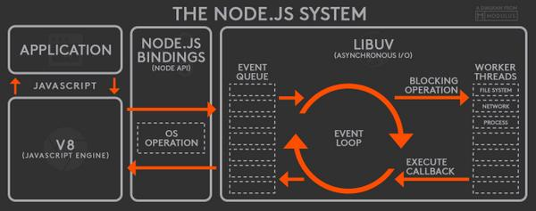

# node的组成和运作方式

> 以下内容主要涉及node的一些概念、架构、特点、机制、基本模块等内容。包含日常编程概念的一些总结，更清楚地认识node到底是什么...

### node到底是什么？

#### 1、node不是语言，是一个js运行平台（runtime），是一个javascript这个语言执行的平台。提供一些API则用来处理后端任务，比如响应请求，读取文件等，这些API由不同的模块提供。因为关注领域不一样，因此所做的任务就不一样，提供的API就不一样，但是原理、相关实现大致与浏览器端相同。

#### 2、node到底包含了什么？具体可以参考下图：
>  

名词解释如下：

**V8**：Google 开源的高性能 JavaScript 引擎，以 C++ 实现。这也是集成在 Chrome 中的 JS 引擎。V8 将你写的 JavaScript 代码编译为机器码（所以它超级快）然后执行。V8 有多快？看看这个爆栈网的回答。   

**libuv**：提供异步功能的 C 库。它在运行时负责一个事件循环（Event Loop）、一个线程池、文件系统 I/O、DNS 相关和网络 I/O，以及一些其他重要功能。

**其他 C/C++ 组件和库**：如 c-ares、crypto (OpenSSL)、http-parser 以及 zlib。这些依赖提供了对系统底层功能的访问，包括网络、压缩、加密等。

**应用/模块（Application/Modules）**：这部分就是所有的 JavaScript 代码：你的应用程序、Node.js 核心模块、任何 npm install 的模块，以及你写的所有模块代码。你花费的主要精力都在这部分。

**绑定（Bindings）**：Node.js 用了这么多 C/C++ 的代码和库，简单来说，它们性能很好。不过，JavaScript 代码最后是怎么跟这些 C/C++ 代码互相调用的呢？这不是三种不同的语言吗？确实如此，而且通常不同语言写出来的代码也不能互相沟通，没有 binding 就不行。Binding 是一些胶水代码，能够把不同语言绑定在一起使其能够互相沟通。在 Node.js 中，binding 所做的就是把 Node.js 那些用 C/C++ 写的库接口暴露给 JS 环境。这么做的目的之一是代码重用：这些功能已经有现存的成熟实现，没必要只是因为换个语言环境就重写一遍，如果桥接调用一下就足够的话。另一个原因是性能：C/C++ 这样的系统编程语言通常都比其他高阶语言（Python、JavaScript、Ruby 等等）性能更高，所以把主要消耗 CPU 的操作以 C/C++ 代码来执行更加明智。

**C/C++ Addons**：Binding 仅桥接 Node.js 核心库的一些依赖，zlib、OpenSSL、c-ares、http-parser 等。如果你想在应用程序中包含其他第三方或者你自己的 C/C++ 库的话，需要自己完成这部分胶水代码。你写的这部分胶水代码就称为 Addon。可以把 Binding 和 Addon 视为连接 JavaScript 代码和 C/C++ 代码的桥梁。 

#### 3、如何运作的呢？
>    

一个 Node.js 应用启动时，V8 引擎会执行你写的应用代码，保持一份观察者（注册在事件上的回调函数）列表。当事件发生时，它的回调函数会被加进一个事件队列。只要这个队列还有等待执行的回调函数，事件循环就会持续把回调函数从队列中拿出并执行。

在回调函数执行过程中，所有的 I/O 请求都会转发给工作线程处理。libuv 维持着一个线程池，包含四个工作线程（默认值，可配置）。文件系统 I/O 请求和 DNS 相关请求都会放进这个线程池处理；其他的请求，如网络、平台特性相关的请求会分发给相应的系统处理单元进行处理。

安排给线程池的这些 I/O 操作由 Node.js 的底层库执行，完成之后触发相应事件，对应的事件回调函数会被放入事件队列，等待执行后续操作。这就是一个事件在 Node.js 中执行的整个生命周期。

>    

图中每一个方块，在事件循环中被称为一个阶段(phase)。

每个阶段都有自己独有的一个用于执行回调函数的 FIFO 队列。当事件循环进入一个指定阶段时，会执行队列中的回调函数，当队列中已经被清空或者执行的回调函数个数达到系统最大限制时，事件循环会进入下一个阶段。

上图中总共有6个阶段：

timers: 该阶段执行由 setTimeout() 和 setInterval() 设置的回调函数。
I/O callbacks: 执行除了close 回调、timers 以及
setImmediate() 设置的回调以外的几乎所有的回调。
idle,prepare: 仅供内部使用。
poll: 检索新的 I/O 事件；在适当的时候 Node.js 会阻塞等待。
check: 执行 setImmediate() 设置的回调。
close callbacks: 执行关闭回调。比如： socket.on('close', ...).
这里有个令人困惑的地方，I/O callbacks 与 poll 这两个阶段有什么区别？ 既然 I/O callbacks 中已经把回调都执行完了，还要 poll 做什么？

查阅了libuv 的文档后发现，在 libuv 的 event loop 中，I/O callbacks 阶段会执行 Pending callbacks。绝大多数情况下，在 poll 阶段，所有的 I/O 回调都已经被执行。但是，在某些情况下，有一些回调会被延迟到下一次循环执行。也就是说，在 I/O callbacks 阶段执行的回调函数，是上一次事件循环中被延迟执行的回调函数。

还需要提到的一点是 process.nextTick()。process.nextTick() 产生的回调函数保存在一个叫做 nextTickQueue 的队列中，不在上面任何一个阶段的队列里面。当当前操作完成后，nextTickQueue 中的回调函数会立即被执行，不管事件循环处在哪个阶段。也就是说，在 nextTickQueue 中的回调函数被执行完毕之前，事件循环不会往前推进。

#### 4、相关术语

**I/O**：输入/输出（Input/Output）的缩写，基本上代指那些主要由计算机 I/O 子系统处理的操作。重 I/O 操作（I/O-bound operations）通常会牵涉到磁盘或驱动器访问，例如数据库访问或文件系统相关操作。类似的概念还有重 CPU 操作（CPU-bound）、重内存操作（Memory-bound）等等。它们的区分是根据系统哪部分性能对这个操作有最大的影响。比如对于某项操作而言，CPU 运算能力提高可以带来最大的提升，这项操作就属于重 CPU 操作。

**非阻塞/异步**：当一项请求发来，应用程序会处理这个请求，其他操作需要等这个请求处理完成才能执行。这个流程的问题是：当大量请求并发时每个请求都需要等待前一个完成，也就是说每个请求都会阻塞后面的所有请求，最糟糕的是如果前一个请求花了很长时间（比如从数据库读取 3GB 的数据）后面所有请求都跟着悲剧了。解决办法可以是引入多处理器和（或）多线程架构，这些办法各有优劣。Node.js 采用了另一种方式，不再为每个请求开启一个新的线程，而是所有请求都在单一的主线程中处理，也只做这么一件事情：处理请求——请求中包含的 I/O 操作如文件系统访问、数据库读写等，都会转发给由 libuv 管理的工作线程去执行。也就是说，请求中的 I/O 操作是异步处理的，而非在主线程上进行。这个办法就使得主线程从不会阻塞，因为所有耗时的任务都分配到了别处。你需要面对的只有唯一的主线程，所有 libuv 管理的工作线程都与你隔离开来，无需操心，Node.js 会处理好那部分。在这个架构之上重 I/O 操作变得格外高效，那些重 CPU、重内存的也一样。Node.js 提供了开箱即用的异步 I/O 调度，还有一些针对重 CPU 执行的处理，不过这已经超出本文话题范畴了。

**事件驱动**：基本上，所有现代系统都是主程序启动完毕之后，对每个收到的请求开启一个进程，接下来根据不同技术有不同的处理方式，有时差异会大相径庭。典型的实现是：针对一个请求开启一个线程，一步接一步执行任务操作，如果某个操作执行缓慢，这个线程上的后续操作都会随之挂起，直到所有操作完成，返回结果。而在 Node.js 中，所有的操作都注册为一个事件，等待主程序或者外部请求来触发。

**（系统）运行时**：Node.js 运行时是指所有这些代码（上述所有组件，包括底层和上层）提供给 Node.js 应用程序执行的环境。

引用：

[[译] Node.js 架构概览](https://segmentfault.com/a/1190000005892501 "[译] Node.js 架构概览")

[node核心特性理解](http://realtcg.com/2017/10/14/node%E6%A0%B8%E5%BF%83%E7%89%B9%E6%80%A7%E7%90%86%E8%A7%A3/ "超链接title")

[Node.js 原理简介](https://www.cnblogs.com/bingooo/p/6720540.html "Node.js 原理简介")

侵删，请联系：<704798445@qq.com>