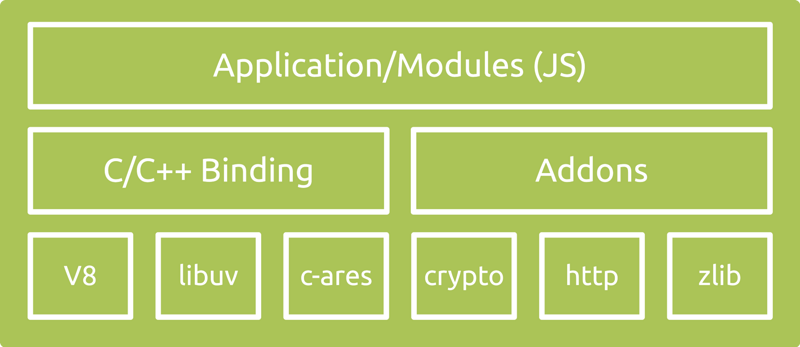

# node的组成和运作方式

> 以下内容主要涉及node的一些概念、架构、特点、机制、基本模块等内容。包含日常编程概念的一些总结，更清楚地认识node到底是什么...

### node到底是什么？

#### 1、node不是语言，是一个js运行平台（runtime），是一个javascript这个语言执行的平台。提供一些API则用来处理后端任务，比如响应请求，读取文件等，这些API由不同的模块提供。因为关注领域不一样，因此所做的任务就不一样，提供的API就不一样，但是原理、相关实现大致与浏览器端相同。

#### 2、node到底包含了什么？具体可以参考下图：
>  

名词解释如下：

**V8**：Google 开源的高性能 JavaScript 引擎，以 C++ 实现。这也是集成在 Chrome 中的 JS 引擎。V8 将你写的 JavaScript 代码编译为机器码（所以它超级快）然后执行。V8 有多快？看看这个爆栈网的回答。   

**libuv**：提供异步功能的 C 库。它在运行时负责一个事件循环（Event Loop）、一个线程池、文件系统 I/O、DNS 相关和网络 I/O，以及一些其他重要功能。

**其他 C/C++ 组件和库**：如 c-ares、crypto (OpenSSL)、http-parser 以及 zlib。这些依赖提供了对系统底层功能的访问，包括网络、压缩、加密等。

**应用/模块（Application/Modules）**：这部分就是所有的 JavaScript 代码：你的应用程序、Node.js 核心模块、任何 npm install 的模块，以及你写的所有模块代码。你花费的主要精力都在这部分。

**绑定（Bindings）**：Node.js 用了这么多 C/C++ 的代码和库，简单来说，它们性能很好。不过，JavaScript 代码最后是怎么跟这些 C/C++ 代码互相调用的呢？这不是三种不同的语言吗？确实如此，而且通常不同语言写出来的代码也不能互相沟通，没有 binding 就不行。Binding 是一些胶水代码，能够把不同语言绑定在一起使其能够互相沟通。在 Node.js 中，binding 所做的就是把 Node.js 那些用 C/C++ 写的库接口暴露给 JS 环境。这么做的目的之一是代码重用：这些功能已经有现存的成熟实现，没必要只是因为换个语言环境就重写一遍，如果桥接调用一下就足够的话。另一个原因是性能：C/C++ 这样的系统编程语言通常都比其他高阶语言（Python、JavaScript、Ruby 等等）性能更高，所以把主要消耗 CPU 的操作以 C/C++ 代码来执行更加明智。

**C/C++ Addons**：Binding 仅桥接 Node.js 核心库的一些依赖，zlib、OpenSSL、c-ares、http-parser 等。如果你想在应用程序中包含其他第三方或者你自己的 C/C++ 库的话，需要自己完成这部分胶水代码。你写的这部分胶水代码就称为 Addon。可以把 Binding 和 Addon 视为连接 JavaScript 代码和 C/C++ 代码的桥梁。 

#### 3、如何运作的呢？
>    

当程序启动，V8引擎会首先解析javascript代码，通过Node bindings来调用C/C++库。执行到当前事件时，会把事件放在调用堆栈（stack和heap）处理（可以理解为放进一个工作空间，如上图），在堆栈中的任何I/O请求都会交给libuv来处理，libuv维持一个线程池，里面是一些工作线程(如下图)，请求会调用这些线程来完成任务，这些线程则调用底层的C/C++库。完成时，libuv再把结果返回事件队列等待主线程执行。在此期间，主线程继续执行其他任务。

引用：
[[译] Node.js 架构概览](https://segmentfault.com/a/1190000005892501 "[译] Node.js 架构概览")

[node核心特性理解](http://realtcg.com/2017/10/14/node%E6%A0%B8%E5%BF%83%E7%89%B9%E6%80%A7%E7%90%86%E8%A7%A3/ "超链接title")
[超链接名](超链接地址 "node核心特性理解")

侵删，请联系：<704798445@qq.com>