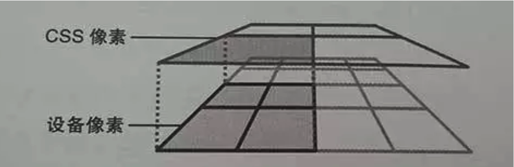
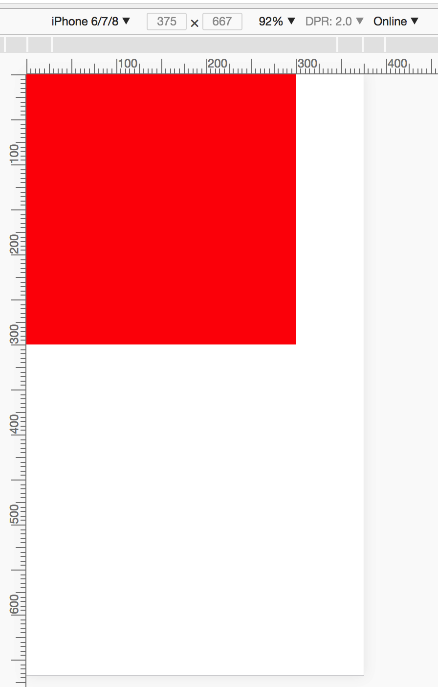

<link rel="stylesheet" type="text/css" href="../static/css/mobile.css">
## 关于移动端 CSS 适配实现

### 1、所需前置知识

a、关于像素
设备像素：设备屏幕的物理像素，对于任何设备来讲物理像素的数量是固定的。
CSS像素：这是一个抽象的像素概念，它是为web开发者创造的。
如下图所示，如果没有缩放（scale = 1） && 设备像素为1 的情况下，二者对应关系：  
>    
> 有缩放（scale = 1） && 设备像素为2 的情况：
> 

b、相对于谁的百分比？
平常我们设置 width:50%，是谁的百分比呢？一般认为是父级的宽度的25%，那html的呢？
关于这个问题，就需要提及概念：布局视口和视觉视口、理想视口
布局视口：整个页面实际的高度和宽度
> document.documentElement.clientWidth    
> document.documentElement.clientHeight    
视觉视口：实际上看到的高度和宽度    
理想视口：我们期望的视觉高度和宽度
> 设置理想窗口方式：     
> <meta name="viewport" content="width=device-width"/>    
> device-width == 理想视口的宽度     
最终作用的还是布局视口，css是依据布局视口计算的。通过上面的meta标签可以将布局视口的宽度设为理想视口。

c、设备像素比(DPR)
设备像素比(Device Pixel Ratio)， 简称：DPR。
> 计算公式： 设备像素比(DPR) = 设备像素个数 / 理想视口CSS像素个数(device-width)    
> 示例：iphone6  横向像素个数为640，理想视口像素个数为320，DPR = 640/320 = 2。    
公式成立的前提条件是：（缩放比例为1）
这里说的：缩放缩小放大的是CSS像素。

d、meta 标签
常见的一个meta标签：
> ```<meta name="viewport" content="width=device-width, initial-scale=1.0, maximum-scale=1.0, user-scalable=no">```    
含义： 类型为viewport，布局视口的宽度 等于 理想视口的宽度，默认缩放为1，最大缩放为1，并且用户不可进行缩放。

f、媒体查询
根据设备类型、布局视口、设备特性，用于支持响应式布局：
>```   
>	@media 媒体类型 and (视口特性阀值){    
>		// 满足条件的css样式代码    
>	}  
>``` 
示例:  
>```  
>	@media all and (min-width: 321px) and (max-width: 400px){    
>		.box{     
>			background: red;    
>		}     
>	}   
>```

### 2、实战

a、设计效果和实现效果
现在有一个宽度为750px的psd设计稿，300px X 300px的正方形：   
> {:width="50%" border="1px solid #333"}    	  
在iphone6上绘制一个的300px X 300px的正方形: 
> 代码如下：
>```
>	<html>
>	<head>
>	<title></title>
>		<meta charset="utf-8" />
>		<meta name="viewport" content="width=device-width,initial-scale=1.0,maximum-scale=1.0,user-scalable=no" />
>		<style>
>			body{
>				margin: 0;
>				padding: 0;
>			}
>			.box{
>				width: 300px;
>				height: 300px;
>				background: red;
>			}
>		</style>
>	</head>
>	<body>
>	    <div class="box"></div>
>	</body>
>	</html>
>```     
>   


