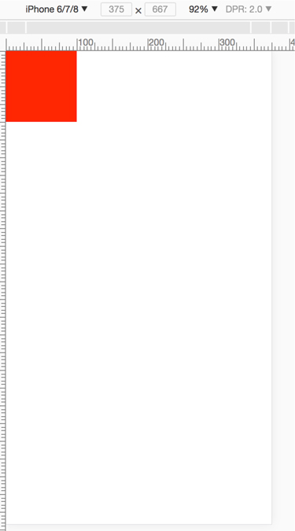

<link rel="stylesheet" type="text/css" href="../static/css/mobile.css">    

## 关于移动端 CSS 适配实现

### 1、所需前置知识

a、关于像素
设备像素：设备屏幕的物理像素，对于任何设备来讲物理像素的数量是固定的。
CSS像素：这是一个抽象的像素概念，它是为web开发者创造的。
如下图所示，如果没有缩放（scale = 1） && 设备像素为1 的情况下，二者对应关系：  
>    
> 有缩放（scale = 1） && 设备像素为2 的情况：     
> 

b、相对于谁的百分比？
平常我们设置 width:50%，是谁的百分比呢？一般认为是父级的宽度的25%，那html的呢？
关于这个问题，就需要提及概念：布局视口和视觉视口、理想视口
布局视口：整个页面实际的高度和宽度
> document.documentElement.clientWidth    
> document.documentElement.clientHeight    
视觉视口：实际上看到的高度和宽度    
理想视口：我们期望的视觉高度和宽度
> 设置理想窗口方式：     
> <meta name="viewport" content="width=device-width"/>    
> device-width == 理想视口的宽度     
最终作用的还是布局视口，css是依据布局视口计算的。通过上面的meta标签可以将布局视口的宽度设为理想视口。

c、设备像素比(DPR)
设备像素比(Device Pixel Ratio)， 简称：DPR。
> 计算公式： 设备像素比(DPR) = 设备像素个数 / 理想视口CSS像素个数(device-width)    
> 示例：iphone6  横向像素个数为640，理想视口像素个数为320，DPR = 640/320 = 2。    
公式成立的前提条件是：（缩放比例为1）
这里说的：缩放缩小放大的是CSS像素。

d、meta 标签
常见的一个meta标签：
> ```<meta name="viewport" content="width=device-width, initial-scale=1.0, maximum-scale=1.0, user-scalable=no">```    
含义： 类型为viewport，布局视口的宽度 等于 理想视口的宽度，默认缩放为1，最大缩放为1，并且用户不可进行缩放。

f、媒体查询
根据设备类型、布局视口、设备特性，用于支持响应式布局：
>```   
>	@media 媒体类型 and (视口特性阀值){    
>		// 满足条件的css样式代码    
>	}  
>``` 
示例:  
>```  
>	@media all and (min-width: 321px) and (max-width: 400px){    
>		.box{     
>			background: red;    
>		}     
>	}   
>```


### 2、实战

a、设计效果和实现效果
现在有一个宽度为750px的psd设计稿，300px X 300px的正方形：   
>     			   	  
在iphone6上绘制一个的300px X 300px的正方形，代码如下：   
>```
>	<html>
>	<head>
>	<title></title>
>		<meta charset="utf-8" />
>		<meta name="viewport" content="width=device-width,initial-scale=1.0,maximum-scale=1.0,user-scalable=no" />
>		<style>
>			body{
>				margin: 0;
>				padding: 0;
>			}
>			.box{
>				width: 300px;
>				height: 300px;
>				background: red;
>			}
>		</style>
>	</head>
>	<body>
>	    <div class="box"></div>
>	</body>
>	</html>
>```     
iphone6上面 300X300px的正方形：   
>   

em~em~~，和想象中不一样？

还记得公式么：
> 设备像素比（DPR） = 设备像素个数 / 理想视口像素个数（device-width）    
> iphone6的设备像素比为2，设备像素为750，实际显示的理想视口尺寸：375px。   
> 所以上面代码最终导致的是：使我们布局视口的宽度变成了375px    
所以我们需要调整css，将高宽改为： 150X150：
>```
>	<html>
>	<head>
>	<title></title>
>		<meta charset="utf-8" />
>		<meta name="viewport" content="width=device-width,initial-scale=1.0,maximum-scale=1.0,user-scalable=no" />
>		<style>
>			body{
>				margin: 0;
>				padding: 0;
>			}
>			.box{
>				width: 150px;
>				height: 150px;
>				background: red;
>			}
>		</style>
>	</head>
>	<body>
>	    <div class="box"></div>
>	</body>
>	</html>
>```   
这下就和设计稿一致了：    
>  

b、分析
1）、现在我们按照iphone6的dpr值2倍编写css，实现了psd效果，如果设备像素比(dpr)为1、2.5、3的，现在编写的css，显示效果肯定不对！
2）、如果我们能将布局视口的尺寸设置为和设备像素尺寸相等的话，这样我们就保证了设计图与页面的1:1关系，那么我们就可以直接使用psd中测量的尺寸了，然后在其他尺寸的手机中，我们进行等比缩放就ok了。
3）、那么如何才能让布局视口的尺寸等于设备像素尺寸呢？    
4）、meta标签上width=device-width 中：
> width：是布局视口的width    
> device-width：是理想视口的宽度    
> 根据公式(缩放比例为1)：设备像素比（DPR） = 设备像素个数 / 理想视口像素个数（device-width）    
> 以iphone6为例：   
> 设备像素比（DPR）：2    
> 设备像素个数：750    
> 所以在缩放比例为1的情况下，iphone6理想视口的像素个数为 750 / 2 = 375，也就是说，对于iphone6来讲 device-width的值为375           
现在我们要把当前的css像素缩放为原来的 1/2：          
> ``` <meta name="viewport" content="width=device-width,initial-scale=0.5,maximum-scale=0.5,user-scalable=no" />```         
原始对应：    
>                   
现在对应关系：         
>          

c、适配各种不同的dpr值的实现       
1）、浏览器提供获取dpr的值：window.devicePixelRatio        
2）、计算方式：     
> // 获取缩放比例          
> var scale = 1 / window.devicePixelRatio;           
> // 动态添加meta标签       
> document.querySelector('meta[name="viewport"]').setAttribute('content','width=device-width,initial-scale=' + scale + ', maximum-scale=' + scale + ', minimum-scale=' + scale + ', user-scalable=no');  
3）、完整代码实现：       
>```
>	<html>
>	<head>
>	<title></title>
>		<meta charset="utf-8" />
>		<meta name="viewport" content="" />
>		<style>
>			body{
>				margin: 0;
>				padding: 0;
>			}
>			.box{
>				width: 300px;
>				height: 300px;
>				background: red;
>			}
>		</style>
>	</head>
>	<body>
>	    <div class="box"></div>
>	</body>
>	<script>
>	var scale = 1 / window.devicePixelRatio;
>	document.querySelector('meta[name="viewport"]').setAttribute('content','width=device-width,initial-scale=' + scale + ', maximum-scale=' + scale + ', minimum-scale=' + scale + ', user-scalable=no');
>	</script>
>	</html>
>```  
4）、显示的宽度，现在一致了，但是有了新的问题      
iphone6显示：       
>                 
iphone5显示：        
>         

问题： 宽度一致了，但是占屏幕的比例不对了~~     

d、引入rem        

1）、定义           
> rem是相对尺寸单位，相对于html标签字体大小的单位，举个例子：               
> 如果html的font-size = 16px;            
> 则：1rem = 18px（重点：rem是基于html标签的字体大小的）。  

2）、动态设置html字体大小： 
> * document.documentElement.style.fontSize = document.documentElement.clientWidth / 10 + 'px';      
> * 元素的rem尺寸 = 元素的psd稿测量的像素尺寸 / 动态设置的html标签的font-size值
> * 以iphone6为例，html标签的font-size的值就等于 750 / 10 = 75px 了，这样 1rem = 75px，所以红色方块300px换算为rem单位就是 300 / 75 = 4rem;                   
> * 因为iphone5的设备像素为640，所以iphone的html标签的font-size的值为 640 / 10 = 64px，所以 1rem = 64px，所以在iphone6中显示为300px的元素在iphone5中会显示为 4 * 64px；             
> * 这样，在不同设备中就实现了让元素等比缩放从而不影响布局。而上面的方法也是手机淘宝所用的方法。所以，现在你只需要将你测量的尺寸数据除以75就转换成了rem单位，如果是iPhone5就要除以64，即除以你动态设置的font-size的值。                

3）、代码实现：              
>```
>	<html>
>	<head>
>	<title></title>
>		<meta charset="utf-8" />
>		<meta name="viewport" content="" />
>		<style>
>			body{
>				margin: 0;
>				padding: 0;
>			}
>			.box{
>				width: 4rem;
>				height: 4rem;
>				background: red;
>			}
>		</style>
>	</head>
>	<body>
>	    <div class="box"></div>
>	</body>
>	<script>
>		// 将布局视口大小设为设备像素尺寸：
>		var scale = 1 / window.devicePixelRatio;
>		document.querySelector('meta[name="viewport"]').setAttribute('content','width=device-width,initial-scale=' + scale + ', maximum-scale=' + scale + ', minimum-scale=' + scale + ', user-scalable=no');
>		// 按照比例设置html字体大小
>		document.documentElement.style.fontSize = document.documentElement.clientWidth / 10 + 'px';
>	</script>
>	</html>
>```   

此时，比例显示正确:      

>            


#### 到此结束      


