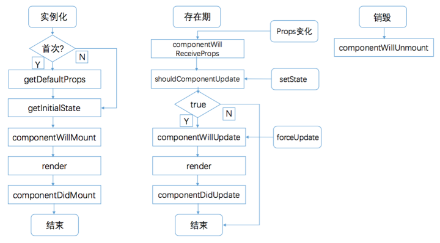

# 面试题目总结第二部分 -- React

### 一、React

#### 1、基本概念

##### 1）项目描述

1、用来构建UI的 JavaScript库    
2、React 不是一个 MVC 框架，仅仅是视图（V）层的库
2、使用组件化开发方式，符合现代Web开发的趋势    
3、技术成熟，社区完善，配件齐全，适用于大型Web项目（生态系统健全）

##### 2）虚拟DOM（Virtual DOM）

> React将DOM抽象为虚拟DOM，虚拟DOM其实就是用一个对象来描述DOM，通过对比前后两个对象的差异，最终只把变化的部分重新渲染，提高渲染的效率

剪裁方式：深度优先遍历 + 差异类型比较 => 再渲染dom

##### 3）Diff算法（虚拟DOM的加速器，提升React性能的法宝）

> 1、key的重要性：如果没有key，所有兄弟节点，都会重新渲染；   
> 2、尽可能的减少数组index作为key，数组中插入元素的等操作时，会使得效率底下   

#### 2、React中常见模式

> 1、混入（mixins） 常见于：高阶组件（HOC）

什么是高阶组件：一个高阶组件只是一个包装了另外一个 React 组件的 React 组件。

```
const EnhancedComponent = higherOrderComponent(WrappedComponent);
```
> 可以实现的功能：
> a、属性代理（Props Proxy）：高阶组件操控传递给 WrappedComponent 的 props；   
> b、反向继承（Inheritance Inversion）：高阶组件继承（extends）WrappedComponent。  

作用：

1、代码复用，逻辑抽象，抽离底层准备（bootstrap）代码    
2、渲染劫持     
3、State 抽象和更改     
4、Props 更改     

最简单示例：
1、Props Proxy （PP）
```
function ppHOC(WrappedComponent) {
  return class PP extends React.Component {
    render() {
      return <WrappedComponent {...this.props}/>
    }
  }
}
```

> 2、组合模式 常见于：各种模块

> 3、工厂模式 ReactComponent 加工成不同的componet

#### 3、ReactClass
对比 ES5 写法: var MyComponent = React.createClass({})，ES6写法：class MyComponent extends React.Component;

#### 4、redux
> 1、redux用于解决多个UI组件之间的数据共享问题。
> 2、严格数据只能在一个方向上流动。
> 3、所有的数据（比如state）被保存在一个被称为store的容器中 → 在一个应用程序中只能有一个。store本质上是一个状态树，保存了所有对象的状态。  
> 4、“model view update” 原则

##### redux微型源码
```
const changeStateFn = (state, action) => {
	console.log(state, action);
	switch(action.type){
		case "PLAY_VIDEO":
			return {
				...state,
				"title": action.title
			};
		    break;
		case "NEXT_VIDEO":
			return {
				...state,
				"title": action.title
			};
		   break;
		case "STOP_VIDEO":
			return {
				...state,
				"title": action.title
			};
		    break;
		default:
			return state;
			break;
	}
}

const createStore = (reducer) => {
	let state = {};

	let listeners = [];

	const getState = () => {
		return state;
	}
	const dispatch = (action) => {
		// 需要更新状态
		state = reducer(state, action);
		// 调用所有监听
		listeners.forEach((listener) => {
		   listener();
		})
	}

	const subscribe = (listener) =>{
		listeners.push(listener);
	}

	return {getState, dispatch, subscribe}
}

const store = createStore(changeStateFn);

const renderApp = (newState, oldState) => {
	if (newState === oldState) {
		return ;
	}
	console.log("render");
};

let oldState = store.getState();

// 订阅事件
store.subscribe(() => {
	// 获取最新状态
	const newState = store.getState();
	// 渲染
	renderApp(newState, oldState);
	// 更新老状态
	oldState = newState;
	console.log("oldState:", oldState);
});

store.dispatch({"type": "PLAY_VIDEO", "title": "播放中"});
setTimeout(()=>{
  store.dispatch({"type": "PLAY_VIDEO", "title": "播放结束"});
}, 100);
```

#### react生命周期

生命周期图如下：

> 

>   


> a、首先，我们看一下一个组件的构造：

```
import React, { Component } from "react";

Class Test extends Component{
  constructor(props, context){
    super(props, context);
    this.state = {
      // 定义state
    }
  }

  getDefaultProps(){}
  getInitialState(){}
  componentWillMount(){}
  componentDidMount(){}
  componentWillReceiveProps(nextProps){}
  shouldComponentUpdate(nextProps, nextState){}
  componentWillUpdate(nextProps, nextState){}
  componentDidUpdate(prevProps, prevState){}

  render(){
    return(<div></div>)
  }

  componentWillUnmout(){}

}
```
理解：
> 1、组建经历constructor初始化数据；    
> 2、进入componentWillMount 组件即将挂载 逻辑     
> 3、当组件第一次完成渲染，会触发 componentDidMount， 表示dom节点已经生成，可以使用调用的异步函数，进行数据调用，并且将返回数据setState;      
> 4、componentWillReceiveProps 是在父组件改变了传入的 props 的时候，会首选调用，平常使用：会用nextProps和this.props对比判断，然后setState;       
> 5、shouldComponentUpdate 可以用于在父组件更新后，导致子组件重新渲染都得逻辑，如果不重新渲染子组件，可以在此部分进行 return  false 处理，不做子组件更新;       
> 6、componentWillUpdate 是在 shouldComponentUpdate return false的时候调用；      
> 7、redner 会在react更新完成后，根据diff算法，会拿到一个差异最小的dom借点书，进行渲染
> 8、render完成后，会进入 componentDidUpdate
> 9、当卸载组件的时候，会促发： componentWillUnmout ，可以用于销毁组件的时候，某些操作还在进行的时候，作为判断使用：

```
componentDidMount(){
  this.isMount = true;
  axios.post().then((res)=>{
    this.isMount && this.setState({
      res: res
    });
  });
}
componentWillUnmout(){
  this.isMount = false;
}
```

更新顺序：
> 1、react的组件挂载及render过程中，最底层的子组件是最先完成挂载及更新的。   
> constructor()构造函数、componentWillMount执行顺序：顶层父组件--子组件--子组件--...--底层子组件    
> 2、render、componentDidMount顺序：底层子组件--子组件--子组件--...--顶层父组件

update phases同理
