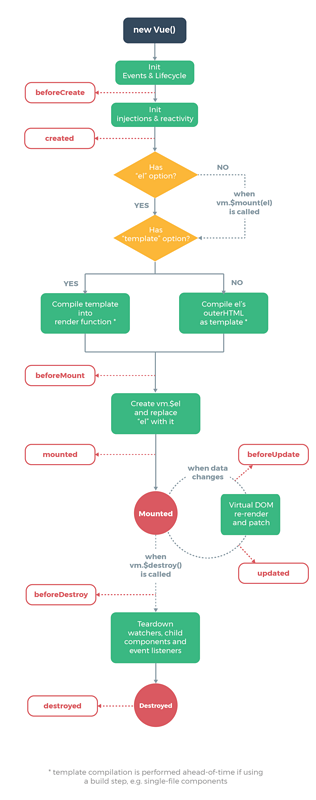

# 面试题目总结第二部分 -- Vue


### Vue

#### 一、实现数据双向绑定

1、Object.definedProperty

```
var person = function() {
    var _name = ' ';
    var obj = {};
    Object.defineProperty(obj, 'name', {
        configurable: true,
        enumerable: true,
        get: function() {
            return _name;
        },
        set: function(n) {
            _name = n;
        }
    })
    return obj;
}();
person.name = "Zhangsan";
person.name // 输出 --> Zhangsan
```

#### 二、生命周期

> 

生命周期包括:

> beforeCreate    
> created    
> beforeMount    
> mounted    
> beforeUpdate    
> updated    
> beforeDestroy    
> destroyed

示例代码：  
```
var vm = new Vue({
    el: '#app',
    data: {
      message: 'Vue的生命周期'
    },
    beforeCreate: function() {
      console.group('------beforeCreate创建前状态------');
      console.log("%c%s", "color:red" , "el     : " + this.$el); //undefined
      console.log("%c%s", "color:red","data   : " + this.$data); //undefined
      console.log("%c%s", "color:red","message: " + this.message)
    },
    created: function() {
      console.group('------created创建完毕状态------');
      console.log("%c%s", "color:red","el     : " + this.$el); //undefined
      console.log("%c%s", "color:red","data   : " + this.$data); //已被初始化
      console.log("%c%s", "color:red","message: " + this.message); //已被初始化
    },
    beforeMount: function() {
      console.group('------beforeMount挂载前状态------');
      console.log("%c%s", "color:red","el     : " + (this.$el)); //已被初始化
      console.log(this.$el);
      console.log("%c%s", "color:red","data   : " + this.$data); //已被初始化  
      console.log("%c%s", "color:red","message: " + this.message); //已被初始化  
    },
    mounted: function() {
      console.group('------mounted 挂载结束状态------');
      console.log("%c%s", "color:red","el     : " + this.$el); //已被初始化
      console.log(this.$el);    
      console.log("%c%s", "color:red","data   : " + this.$data); //已被初始化
      console.log("%c%s", "color:red","message: " + this.message); //已被初始化
    },
    beforeUpdate: function () {
      console.group('beforeUpdate 更新前状态===============》');
      console.log("%c%s", "color:red","el     : " + this.$el);
      console.log(this.$el);   
      console.log("%c%s", "color:red","data   : " + this.$data);
      console.log("%c%s", "color:red","message: " + this.message);
    },
    updated: function () {
      console.group('updated 更新完成状态===============》');
      console.log("%c%s", "color:red","el     : " + this.$el);
      console.log(this.$el);
      console.log("%c%s", "color:red","data   : " + this.$data);
      console.log("%c%s", "color:red","message: " + this.message);
    },
    beforeDestroy: function () {
      console.group('beforeDestroy 销毁前状态===============》');
      console.log("%c%s", "color:red","el     : " + this.$el);
      console.log(this.$el);    
      console.log("%c%s", "color:red","data   : " + this.$data);
      console.log("%c%s", "color:red","message: " + this.message);
    },
    destroyed: function () {
      console.group('destroyed 销毁完成状态===============》');
      console.log("%c%s", "color:red","el     : " + this.$el);
      console.log(this.$el);  
      console.log("%c%s", "color:red","data   : " + this.$data);
      console.log("%c%s", "color:red","message: " + this.message)
    }
  });
  ```

  更多链接： https://segmentfault.com/a/1190000011381906

  #### VUE插件 vue-router
