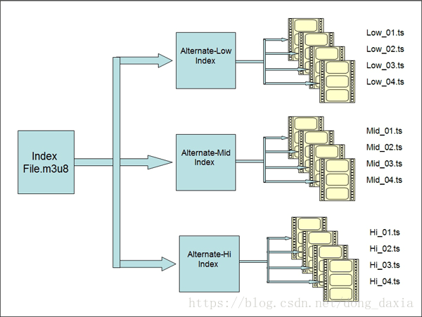
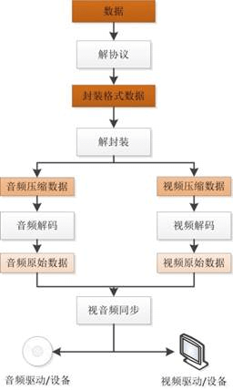

## H5端视频

### 一、HLS 分拆 TS
视频通过流媒体传输协议（目前常用的有两种，MPEG-DASH和Apple的HLS）从服务器端分发给客户端，媒体内容进一步包含在一层传输协议中，video就无法识别了。
以HLS为例，将源文件内容分散地封装到了一个个TS文件中，如下图所示：

 

 video标签无法识别这样的TS文件，那么就引入了MSE拓展来帮助浏览器识别并处理TS文件，将其变回原来可识别的媒体容器格式，浏览器就相当于内置了一个能够解析流协议的播放器，流媒体格式文件在播放器中经过的处理流程：
 
 

 获取二进制文件，通过 Media Source Extensions 将 buffer 内容进行合流，然后组成一个可播的媒体资源文件。

### 二、Video标签

> video标签为拥有解封装和解码功能的浏览器自带播放器。

1、现状和历史

a、原生的 HTML5 video 元素在 Windows PC 上仅支持 mp4 （H.264 编码）、webm、ogg 等格式视频的播放。
b、历史原因（flash时代），很多都高清源都是适用于 Flash 播放的 FLV 格式。


2、解决方式

HTML5 video 不仅可以直接播放上面支持的 mp4、m3u8、webm、ogg 格式，还可以支持由 JS 处理过后的视频流，这样我们就可以用 JS 把一些不支持的视频流格式，转化为支持的格式（如 H.264 的 mp4）。B 站开源的 flv.js 就是这个技术的一个典型实现。
用 MSE 技术，将 FLV 源用 JS 实时转码成 HTML5 支持的视频流编码格式(容器差异)，提供给 HTML5 播放器播放。

3、为何不直接使用 MP4

FLV 天生具备流式特征适合网络流传输，而 MP4 这种使用最广泛的存储格式，设计却并不一定优雅。

### 三、MSE(Media Source Extensions)


MSE 使我们可以把通常的单个媒体文件的 src 值替换成引用 MediaSource 对象（一个包含即将播放的媒体文件的准备状态等信息的容器），以及引用多个 SourceBuffer 对象（代表多个组成整个串流的不同媒体块）的元素。MSE 让我们能够根据内容获取的大小和频率，或是内存占用详情（例如什么时候缓存被回收），进行更加精准地控制。 它是基于它可扩展的 API 建立自适应比特率流客户端（例如DASH 或 HLS 的客户端）的基础。过程如下：
> Download -> Response.arrayBuffer(适用fetch/xhr等异步获取流媒体数据) -> SourceBuffer(添加到MediaSource的buffer中) -> video/audio标签

1、使用createObjectURL将MediaSource和video标签连接起来

```
    var mediaSource = new MediaSource();
    //console.log(mediaSource.readyState); // closed
    video.src = URL.createObjectURL(mediaSource);
    mediaSource.addEventListener('sourceopen', sourceOpen);
```

```
<html><head>
    <meta charset="utf-8">
  </head>
  <body>
    <video controls=""></video>
    <script>
      var video = document.querySelector('video');

      var assetURL = 'frag_bunny.mp4';
      // Need to be specific for Blink regarding codecs
      // ./mp4info frag_bunny.mp4 | grep Codec
      var mimeCodec = 'video/mp4; codecs="avc1.42E01E, mp4a.40.2"';

      if ('MediaSource' in window && 
      MediaSource.isTypeSupported(mimeCodec)) {
        var mediaSource = new MediaSource;
        //console.log(mediaSource.readyState); // closed
        video.src = URL.createObjectURL(mediaSource);
        mediaSource.addEventListener('sourceopen', sourceOpen);
      } else {
        console.error('Unsupported MIME type or codec: ', mimeCodec);
      }

      function sourceOpen (e) {
        //console.log(this.readyState); // open
        var mediaSource = e.target;
        var sourceBuffer = mediaSource.addSourceBuffer(mimeCodec);
        fetchAB(assetURL, function (buf) {
          sourceBuffer.addEventListener('updateend', function (_) {
            mediaSource.endOfStream();
            video.play();
            //console.log(mediaSource.readyState); // ended
          });
          console.log("buf",buf);
          sourceBuffer.appendBuffer(buf);
        });
      };

      function fetchAB (url, cb) {
        console.log(url);
        var xhr = new XMLHttpRequest;
        xhr.open('get', url);
        xhr.responseType = 'arraybuffer';
        xhr.onload = function () {
          cb(xhr.response);
        };
        xhr.send();
      };
    </script>
</body></html>
```

支持事件：

(1)sourceopen 绑定到媒体元素后开始触发
(2)sourceclosed 未绑定到媒体元素后开始触发
(3)sourceended 所有数据接收完成后触发

对应的属性mediaSource.readyState

(1)open MSE 实例，已经绑定到了媒体元素上，等待接受数据或者正在接受数据
(2)closed MSE 实例未绑定到了媒体元素上。MS刚创建时就是该状态。
(3)ended MSE 实例，已经绑定到了媒体元素上, 并且所有数据都已经接受到了。当endOfStream()执行完成，会变为该状态。